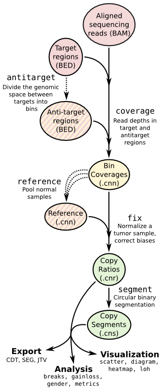

Copy number calling pipeline
============================



Each operation is invoked as a sub-command of the main script, ``cnvkit.py``.
A listing of all sub-commands can be obtained with ``cnvkit --help`` or ``-h``,
and the usage information for each sub-command can be shown with the ``--help``
or ``-h`` option after each sub-command name::

    cnvkit.py -h
    cnvkit.py target -h

A sensible output file name is normally chosen if it isn't specified, except in
the case of the text reporting commands, which print to standard output by
default, and the matplotlib-based plotting commands (not ``diagram``), which
will display the plots interactively on the screen by default.


.. _batch:

``batch``
---------

Run the CNVkit pipeline on one or more BAM files::

    # From baits and tumor/normal BAMs
    cnvkit.py batch *Tumor.bam --normal *Normal.bam \
        --targets my_baits.bed --annotate refFlat.txt \
        --fasta hg19.fasta --access data/access-5kb-mappable.hg19.bed \
        --output-reference my_reference.cnn --output-dir results/ \
        --diagram --scatter

    # Reusing a reference for additional samples
    cnvkit.py batch *Tumor.bam -r Reference.cnn -d results/

    # Reusing targets and antitargets to build a new reference, but no analysis
    cnvkit.py batch -n *Normal.bam --output-reference new_reference.cnn \
        -t my_targets.bed -a my_antitargets.bed \
        -f hg19.fasta -g data/access-5kb-mappable.hg19.bed

With the ``-p`` option, process each of the BAM files in parallel, as separate
subprocesses. The status messages logged to the console will be somewhat
disorderly, but the pipeline will take advantage of multiple CPU cores to
complete sooner.

::

    cnvkit.py batch *.bam -r my_reference.cnn -p 8

The pipeline executed by the ``batch`` command is equivalent to::

    cnvkit.py access hg19.fa -o access.hg19.bed
    cnvkit.py autobin *.bam -t baits.bed -g access.hg19.bed [--annotate refFlat.txt --short-names]

    # For each sample...
    cnvkit.py coverage Sample.bam baits.target.bed -o Sample.targetcoverage.cnn
    cnvkit.py coverage Sample.bam baits.antitarget.bed -o Sample.antitargetcoverage.cnn

    # With all normal samples...
    cnvkit.py reference *Normal.{,anti}targetcoverage.cnn --fasta hg19.fa -o my_reference.cnn

    # For each tumor sample...
    cnvkit.py fix Sample.targetcoverage.cnn Sample.antitargetcoverage.cnn my_reference.cnn -o Sample.cnr
    cnvkit.py segment Sample.cnr -o Sample.cns

    # Post-processing for each tumor sample...
    cnvkit.py segmetrics Sample.cnr -s Sample.cns --ci --alpha 0.5 --smooth-bootstrap -o Sample.segmetrics.cns.tmp
    cnvkit.py call Sample.segmetrics.cns.tmp --method none --filter ci -o Sample.call.cns.tmp
    cnvkit.py segmetrics Sample.cnr -s Sample.call.cns.tmp --t-test -o Sample.segmetrics.cns.tmp2
    cnvkit.py call Sample.segmetrics.cns.tmp2 --center median -o Sample.call.cns
    cnvkit.py bintest Sample.cnr -s Sample.call.cns.tmp --target -o Sample.bintest.cns

    # Optionally, with --scatter and --diagram
    cnvkit.py scatter Sample.cnr -s Sample.cns -o Sample-scatter.pdf
    cnvkit.py diagram Sample.cnr -s Sample.cns -o Sample-diagram.pdf

This is for hybrid capture protocols in which both on- and off-target reads can
be used for copy number detection. To run alternative pipelines for targeted
amplicon sequencing or whole genome sequencing, use the ``--method`` option with
value ``amplicon`` or ``wgs``, respectively. The default is ``hybrid``.

See the rest of the commands below to learn about each of these steps and other
functionality in CNVkit.


.. _target:

``target``
----------

Prepare a BED file of baited regions for use with CNVkit.

::

    cnvkit.py target my_baits.bed --annotate refFlat.txt --split -o my_targets.bed

The BED file should be the baited genomic regions for your target capture kit,
as provided by your vendor. Since these regions (usually exons) may be of
unequal size, the ``--split`` option divides the larger regions so that the
average bin size after dividing is close to the size specified by
``--average-size``.  If any of these three (``--split``, ``--annotate``, or
``--short-names``) flags are used, a new target BED file will be created;
otherwise, the provided target BED file will be used as-is.

If you don't have the capture regions BED file, but you do know which commercial
exome capture kit was used to prepare your samples, you might find the file you
need in `Astra-Zeneca's reference data repository
<https://github.com/AstraZeneca-NGS/reference_data>`_.
Otherwise, try searching the vendor's website or contacting their customer
support for the right file.  Failing that, you can try the :doc:`script
guess_baits.py <scripts>` included with the CNVkit distribution, along with the
known exonic regions for your reference genome.  But CNVkit will work much
better if you have the real capture region coordinates -- contact your
sequencing lab for help with this step.


Bin size and resolution
```````````````````````

If you need higher resolution, you can select a smaller average size for your
target and :ref:`antitarget` bins.

Exons in the human genome have an average size of about 200bp. The target bin
size default of 267 is chosen so that splitting larger exons will produce bins
with a minimum size of 200. Since bins that contain fewer reads result in a
noisier copy number signal, this approach ensures the "noisiness" of the bins
produced by splitting larger exons will be no worse than average.

Setting the average size of target bins to 100bp, for example, will yield about
twice as many target bins, which might result in higher-resolution segmentation.
However, the number of reads counted in each bin will be reduced by about half,
increasing the variance or "noise" in bin-level coverages.
An excess of noisy bins can make visualization difficult, and since the noise
may not be normally distributed, especially in the presence of many bins with
zero reads, the segmentation algorithm could produce less accurate results on
low-coverage samples.
In practice we see good results with an average of 200--300 reads per bin; we
therefore recommend an overall on-target sequencing coverage depth of at least
200x to 300x with a read length of 100bp to justify reducing the average target
bin size to 100bp.

For hybrid capture, if your targets are not **tiled with uniform density** --
for example, if your target panel is designed with a subset of targets having
twice or half the usual number of tiles for a fixed number of genomic bases --
you do not need to do anything in particular to compensate for this as long as
you are using a pooled :ref:`reference`. When a test sample's read depths are
normalized to the pooled reference, the log2 ratios will even out. However, the
"spread" of those bins in your pooled reference, and the "weight" of the
corresponding bins in the test sample's .cnr file, will be correspondingly
higher or lower.

If some targets are enriched separately for each sample via **spike-in**, rather
than as part of the original capture panel (which is assumed to have a fairly
consistent capture efficiency across targets for all test and control samples),
then the spike-in capture efficiency will typically vary too much to be useful
as a copy number signal. In that case, the spike-in region should **not** be
included in the target BED file, and **excluded** from the :ref:`access` regions
(which determine :ref:`antitarget` regions) by using the ``-x`` option.


Labeling target regions
```````````````````````

In case the vendor BED file does not label each region with a corresponding gene
name, the ``--annotate`` option can add or replace these labels.
Gene annotation databases, e.g. RefSeq or Ensembl, are available in "flat"
format from UCSC (e.g. `refFlat.txt for hg19
<http://hgdownload.soe.ucsc.edu/goldenPath/hg19/database/refFlat.txt.gz>`_).

In other cases the region labels are a combination of human-readable gene names
and database accession codes, separated by commas (e.g.
"ref|BRAF,mRNA|AB529216,ens|ENST00000496384"). The ``--short-names`` option
splits these accessions on commas, then chooses the single accession that covers
in the maximum number of consecutive regions that share that accession, and
applies it as the new label for those regions. (You may find it simpler to just
apply the refFlat annotations.)

The targets do not need to be genes, but for convenience CNVkit's documentation
and source code generally refer to consecutive targeted regions with the same
label as "genes".


.. _access:

``access``
----------

Calculate the sequence-accessible coordinates in chromosomes from the given
reference genome, output as a BED file.

::

    cnvkit.py access hg19.fa -x excludes.bed -o access-excludes.hg19.bed
    cnvkit.py access mm10.fasta -s 10000 -o access-10kb.mm10.bed

Many fully sequenced genomes, including the human genome, contain large regions
of DNA that are inaccessable to sequencing. (These are mainly the centromeres,
telomeres, and highly repetitive regions.) In the reference genome sequence
these regions are filled in with large stretches of "N" characters.
These regions cannot be mapped by resequencing, so CNVkit avoids them when
calculating the :ref:`antitarget` bin locations.

The ``access`` command computes the locations of the accessible sequence regions
for a given reference genome based on these masked-out sequences, treating long
spans of 'N' characters as the inaccessible regions and outputting the
coordinates of the regions between them.

Other known unmappable, variable, or poorly sequenced regions can be
excluded with the ``-x``/``--exclude`` option.
This option can be used more than once to exclude several BED files listing
different sets of regions.
For example, regions of poor mappability have been precalculated by others and
are available from the `UCSC FTP Server
<ftp://hgdownload.soe.ucsc.edu/goldenPath/>`_ (see `here for hg19
<ftp://hgdownload.soe.ucsc.edu/goldenPath/hg19/encodeDCC/wgEncodeMapability/>`_).

If there are many small excluded/inaccessible regions in the genome, then small,
less-reliable antitarget bins would be squeezed into the remaining accessible
regions.  The ``-s`` option ignores short regions that would otherwise be
excluded, allowing larger antitarget bins to overlap them.

An "access" file precomputed for the UCSC reference human genome build hg19,
with some know low-mappability regions excluded, is included in the CNVkit
source distribution under the ``data/`` directory
(``data/access-5kb-mappable.hg19.bed``).


.. _antitarget:

``antitarget``
--------------

Given a "target" BED file that lists the chromosomal coordinates of the tiled
regions used for targeted resequencing, derive a BED file
off-target/"antitarget" regions.

::

    cnvkit.py antitarget my_targets.bed -g data/access-5kb-mappable.hg19.bed -o my_antitargets.bed

Certain genomic regions cannot be mapped by short-read resequencing (see
:ref:`access`); we can avoid them when calculating the antitarget locations by
passing the locations of the accessible sequence regions with the ``-g`` or
``--access`` option. CNVkit will then compute "antitarget" bins only within the
accessible genomic regions specified in the "access" file.

CNVkit uses a cautious default off-target bin size that, in our experience, will
typically include more reads than the average on-target bin.  However, we
encourage the user to examine the coverage statistics reported by CNVkit and
specify a properly calculated off-target bin size for their samples in order to
maximize copy number information.


Off-target bin size
```````````````````

An appropriate off-target bin size can be computed as the product of the average
target region size and the fold-enrichment of sequencing reads in targeted
regions, such that roughly the same number of reads are mapped to on-- and
off-target bins on average --- roughly proportional to the level of on-target
enrichment. The :ref:`autobin` command (below) can quickly estimate these
values, but you are free to specify your own.

Average off-target coverage depths can also be obtained with the script
CollectHsMetrics in the Picard suite (http://picard.sourceforge.net/), or from
the console output of the CNVkit :ref:`coverage` command when run on the target
regions.

.. note::
    The generated off-target bins are given the label "Antitarget" in CNVkit
    versions 0.9.0 and later. In earlier versions, the label "Background" was
    used -- CNVkit will still accept this label for compatibility.


.. _autobin:

``autobin``
-----------

Quickly estimate read counts or depths in a BAM file to estimate reasonable on-
and (if relevant) off-target bin sizes. If multiple BAMs are given, use the BAM
with median file size.

Generates target and (if relevant) antitarget BED files, and prints a table of
estimated average read depths and recommended bin sizes on standard output.

::

    cnvkit.py autobin *.bam -t my_targets.bed -g access.hg19.bed
    cnvkit.py autobin *.bam -m amplicon -t my_targets.bed
    cnvkit.py autobin *.bam -m wgs -b 50000 -g access.hg19.bed --annotate refFlat.txt

The BAM index (.bai) is used to quickly determine the total number of reads
present in a file, and random sampling of targeted regions (``-t``) is used to
estimate average on-target read depth much faster than the :ref:`coverage`
command.


.. _coverage:

``coverage``
------------

Calculate coverage in the given regions from BAM read depths.

By default, coverage is calculated via mean read depth from a pileup.
Alternatively, using the ``--count`` option counts
the number of read start positions in the interval and normalizes to the
interval size.

::

    cnvkit.py coverage Sample.bam targets.bed -o Sample.targetcoverage.cnn
    cnvkit.py coverage Sample.bam antitargets.bed -o Sample.antitargetcoverage.cnn

Summary statistics of read counts and their binning are printed to standard
error when CNVkit finishes calculating the coverage of each sample (through
either the :ref:`batch` or :ref:`coverage` commands).

BAM file preparation
````````````````````

For best results, use an aligner such as `BWA-MEM
<http://bio-bwa.sourceforge.net/>`_, with the option to mark secondary mappings
of reads, and flag PCR
duplicates with a program such as `SAMBLASTER
<https://github.com/GregoryFaust/samblaster>`_, `SAMBAMBA
<http://lomereiter.github.io/sambamba/>`_, or the MarkDuplicates script in
`Picard tools <http://picard.sourceforge.net/>`_, so that CNVkit will skip
these reads when calculating read depth.

You will probably want to index the finished BAM file using `samtools
<http://samtools.sourceforge.net/>`_ or SAMBAMBA.  But if you haven't done this
beforehand, CNVkit will automatically do it for you.

.. note::
    **The BAM file must be sorted.** CNVkit will check that the first few reads
    are sorted in positional order, and raise an error if they are not. However,
    CNVkit might not notice if reads later in the file are unsorted; it will
    just silently ignore the out-of-order reads and the coverages will be zero
    after that point. So be safe, and sort your BAM file properly.

.. note::
    **If you've prebuilt the BAM index file (.bai), make sure its timestamp is
    later than the BAM file's.** CNVkit will automatically index the BAM file
    if needed -- that is, if the .bai file is missing, *or* if the timestamp
    of the .bai file is older than that of the corresponding .bam file. This
    is done in case the BAM file has changed after the index was initially
    created. (If the index is wrong, CNVkit will not catch this, and coverages
    will be mysteriously truncated to zero after a certain point.) *However,*
    if you copy a set of BAM files and their index files (.bai) together over
    a network, the smaller .bai files will typically finish downloading first,
    and so their timestamp will be earlier than the corresponding BAM or FASTA
    file. CNVkit will then consider the index files to be out of date and will
    attempt to rebuild them. To prevent this, use the Unix command ``touch``
    to update the timestamp on the index files after all files have been
    downloaded.


.. _reference:

``reference``
-------------

Compile a copy-number reference from the given files or directory (containing
normal samples). If given a reference genome (-f option), also calculate the GC
content and repeat-masked proportion of each region.

The reference can be constructed from zero, one or multiple control samples (see
below).

A reference should be constructed specifically for each target capture panel,
using a BED file listing the genomic coordinates of the baited regions.
Ideally, the control or "normal" samples used to build the reference should
match the type of sample (e.g. FFPE-extracted or fresh DNA) and library
preparation protocol or kit used for the test (e.g. tumor) samples.

For :doc:`target amplicon or whole-genome sequencing <nonhybrid>` protocols, the
"antitarget" BED and .cnn files can be omitted. Otherwise, ensure the filename
prefixes are the same for each pair of ".targetcoverage.cnn" and
".antitargetcoverage.cnn" files (as it's done by default).


Paired or pooled normals
````````````````````````

Provide the ``*.targetcoverage.cnn`` and ``*.antitargetcoverage.cnn`` files
created by the :ref:`coverage` command::

    cnvkit.py reference *coverage.cnn -f ucsc.hg19.fa -o Reference.cnn

To analyze a cohort sequenced on a single platform, we recommend combining all
normal samples into a pooled reference, even if matched tumor-normal pairs were
sequenced -- our benchmarking showed that a pooled reference performed slightly
better than constructing a separate reference for each matched tumor-normal
pair.
Furthermore, even matched normals from a cohort sequenced together can exhibit
distinctly different copy number biases (see `Plagnol et al. 2012
<http://dx.doi.org/10.1093/bioinformatics/bts526>`_ and `Backenroth et al. 2014
<http://dx.doi.org/10.1093/nar/gku345>`_); reusing a pooled reference across the
cohort provides some consistency to help diagnose such issues.

Notes on sample selection:

* You can use ``cnvkit.py metrics *.cnr -s *.cns`` to see if any samples are
  especially noisy. See the :ref:`metrics` command.

* CNVkit will usually call larger CNAs reliably down to about 10x on-target
  coverage, but there will tend to be more spurious segments, and smaller-scale
  or subclonal CNAs can be hard to infer below that point.
  This is well below the minimum coverage thresholds typically used for SNV
  calling, especially for targeted sequencing of tumor samples that may have
  significant normal-cell contamination and subclonal tumor-cell populations.
  So, a normal sample that passes your other QC checks will probably be OK to
  use in building a CNVkit reference -- assuming it was sequenced on the same
  platform as the other samples you're calling.

If normal samples are not available, it will sometimes be acceptable to build the
reference from a collection of tumor samples. You can use the ``scatter`` command
on the raw ``.cnn`` coverage files to help choose samples with relatively
minimal and non-recurrent CNVs for use in the reference.

With no control samples
```````````````````````

Alternatively, you can create a "flat" reference of neutral copy number (i.e.
log2 0.0) for each probe from the target and antitarget interval files. This
still computes the GC content of each region if the reference genome is given.

::

    cnvkit.py reference -o FlatReference.cnn -f ucsc.hg19.fa -t targets.bed -a antitargets.bed

Possible uses for a flat reference include:

1. Extract copy number information from one or a small number of tumor samples
   when no suitable reference or set of normal samples is available. The copy
   number calls will not be quite as accurate, but large-scale CNVs should still
   be visible.
2. Create a "dummy" reference to use as input to the ``batch`` command to
   process a set of normal samples. Then, create a "real" reference from the
   resulting ``*.targetcoverage.cnn`` and ``*.antitargetcoverage.cnn`` files,
   and re-run ``batch`` on a set of tumor samples using this updated reference.
3. Evaluate whether a given paired or pooled reference is suitable for an
   analysis by repeating the CNVkit analysis with a flat reference and comparing
   the CNAs found with both the original and flat reference for the same
   samples.

How it works
````````````

CNVkit uses robust methods to extract a usable signal from the reference
samples.

Each input sample is first median-centered, then read-depth :doc:`bias
corrections <bias>` (the same used in the :ref:`fix` command) are performed on
each of the normal samples separately.

The samples' median-centered, bias-corrected log2 read depth values are then combined
to take the weighted average (Tukey's biweight location) and spread (Tukey's
biweight midvariance) of the values at each on-- and off-target genomic bin
among all samples.
(For background on these statistical methods see `Lax (1985)
<http://dx.doi.org/10.1080/01621459.1985.10478177>`_ and `Randal (2008)
<http://dx.doi.org/10.1016/j.csda.2008.04.016>`_.)
To adjust for the lower statistical reliability of a smaller number of samples
for estimating parameters, a "pseudocount" equivalent to one sample of neutral
copy number is included in the dataset when calculating these values.

These values are saved in the output "reference.cnn" file as the "log2" and
"spread" columns, indicating the expected read depth and the reliability of this
estimate.

If a FASTA file of the reference genome is given, for each genomic bin the
fraction of GC (proportion of "G" and "C" characters among all "A", "T", "G" and
"C" characters in the subsequence, ignoring "N" and any other ambiguous
characters) and repeat-masked values (proportion of lowercased non-"N"
characters in the sequence)
are calculated and stored in the output "reference.cnn" file as columns "gc" and
"rmask".
For efficiency, the samtools FASTA index file (.fai) is used to locate the
binned sequence regions in the FASTA file.
If the GC or RepeatMasker bias corrections are skipped using the ``--no-gc`` or
``--no-rmask`` options, then those columns are omitted from the output file; if
both are skipped, then the genome FASTA file (if provided) is not examined at
all.

The result is a reference copy-number profile that can then be used to correct
other individual samples.


.. note::
    As with BAM files, CNVkit will automatically index the FASTA file if the
    corresponding .fai file is missing or out of date. If you have copied the
    FASTA file and its index together over a network, you may need to use the
    ``touch`` command to update the .fai file's timestamp so that CNVkit will
    recognize it as up-to-date.


.. _fix:

``fix``
-------

Combine the uncorrected target and antitarget coverage tables (.cnn) and
:doc:`correct for biases <bias>` in regional coverage and GC content, according to
the given reference. Output a table of copy number ratios (.cnr).

::

    cnvkit.py fix Sample.targetcoverage.cnn Sample.antitargetcoverage.cnn Reference.cnn -o Sample.cnr

How it works
````````````

The "observed" on- and off-target read depths are each median-centered and
:doc:`bias-corrected <bias>`, as when constructing the :ref:`reference`.
The corresponding "expected" normalized log2 read-depth values from the
reference are then subtracted for each set of bins.

Bias corrections use the GC and RepeatMasker information from the "gc" and
"rmask" columns of the reference .cnn file; if those are missing (i.e. the
reference was built without those corrections), ``fix`` will skip them too (with
a warning). If you constructed the reference but then called ``fix`` with a
different set of bias correction flags, the biases could be over- or
under-corrected in the test sample -- so use the options ``--no-gc``,
``--no-rmask`` and ``--no-edge`` consistently or not at all.

CNVkit filters out bins failing certain predefined criteria: those where the
reference log2 read depth is below a threshold (default -5), or the spread of read
depths among all normal samples in the reference is above a threshold (default
1.0).

A weight is assigned to each remaining bin depending on:

1. The size of the bin;
2. The deviation of the bin's log2 value in the reference from 0;
3. The "spread" of the bin in the reference.

(The latter two only apply if at least one normal/control sample was used to
build the reference.)

Finally, the corrected on- and off-target bin-level copy ratios with associated
weights are concatenated, sorted, and written to a .cnr file.


.. _segment:

``segment``
-----------

Infer discrete copy number segments from the given coverage table::

    cnvkit.py segment Sample.cnr -o Sample.cns

Segmentation runs independently on each chromosome arm, and can be parallelized
with the ``-p`` option (except for the HMM methods), similar to ``batch``.

The significance threshold to accept a segment or breakpoint is passed to the
underlying method with the option ``--threshold``/``-t``. This is typically the
p-value or q-value cutoff, or whatever parameter the underlying method uses to
adjust its sensitivity.


Segmentation methods
````````````````````

The following segmentation algorithms can be specified with the ``-m`` option:

- ``cbs`` -- the default, circular binary segmentation (CBS). This method
  performed best in our benchmarking on mid-size target panels and exomes.
  Requires the R package DNAcopy.
- ``haar`` -- a pure-Python implementation of `HaarSeg
  <http://webee.technion.ac.il/people/YoninaEldar/Info/software/HaarSeg.htm>`_,
  a wavelet-based method. Very fast and performs reasonably well on small
  panels, but tends to over-segment large datasets.
- ``hmm`` -- Hidden Markov Model with distance-dependent transitions and joint
  log2/BAF emissions. Estimates tumor purity and ploidy via grid search over
  marginal likelihood. Suitable for most samples.
- ``hmm-tumor`` -- HMM with an expanded state space (up to 8 copies) for
  finer-grained segmentation of tumor samples. Can detect focal amplifications
  within larger-scale gains, or focal deep deletions within hemizygous losses.
- ``hmm-germline`` -- HMM with fixed purity=1 and ploidy=2 (no grid search),
  suitable for germline samples and single-cell sequencing of mostly-diploid
  genomes.
- ``none`` -- simply calculate the weighted mean log2 value of each chromosome
  arm. Useful for testing or debugging, or as a baseline for benchmarking other
  methods.


The first method ``cbs`` uses R internally, and to use it you will need to have
R and the R package dependencies installed (i.e. DNAcopy). If you
installed CNVkit with ``conda`` as recommended, these should have been installed
for you automatically. If you installed the R packages in a nonstandard or
non-default location, you can specify the location of the right ``Rscript``
executable you want to use with ``--rscript-path``.

The HMM methods ``hmm``, ``hmm-tumor`` and ``hmm-germline`` use a pure
numpy/scipy implementation with no additional dependencies. When a VCF file
is provided (``-v``), BAF information is jointly modeled with log2 ratios.

The methods ``haar`` and ``none`` do not have any additional dependencies beyond
the basic CNVkit installation.


Bin filtering
`````````````

Bins with a weight of 0 are dropped before segmentation.
Additional filters:

- ``--drop-low-coverage`` -- drop bins with a read depth of 0 or very close to
  0, i.e. a log2 value suggesting the same. Use with tumor samples.
- ``--drop-outliers`` -- drop bins with log2 value too far from a rolling
  average, taking local variability into account. Applied by default.


SNP allele frequencies
``````````````````````

If a :ref:`vcfformat` file is given with the
``--vcf`` option (and accompanying options ``-i``, ``-n``, ``-z``, and
``--min-variant-depth``, which work as in other commands), then after segmenting
log2 ratios, a second pass of segmentation will run within each log2-ratio-based
segment on the SNP allele frequencies loaded from the VCF.

See also :doc:`calling` for suggestions on how to interpret and post-process the
resulting segments.


.. _call:

``call``
--------

Given segmented log2 ratio estimates (.cns), derive each segment's absolute
integer copy number using either:

- A list of threshold log2 values for each copy number state (``-m threshold``),
  or rescaling -  for a given known tumor cell fraction and normal ploidy, then
  simple rounding to the nearest integer copy number (``-m clonal``).

::

    cnvkit.py call Sample.cns -o Sample.call.cns
    cnvkit.py call Sample.cns -y -m threshold -t=-1.1,-0.4,0.3,0.7 -o Sample.call.cns
    cnvkit.py call Sample.cns -y -m clonal --purity 0.65 -o Sample.call.cns
    cnvkit.py call Sample.cns -y -v Sample.vcf -m clonal --purity 0.7 -o Sample.call.cns

The output is another .cns file, with an additional "cn" column listing each
segment's absolute integer copy number. This .cns file is still compatible with
the other CNVkit commands that accept .cns files, and can be plotted the same
way with the :ref:`scatter`, :ref:`heatmap` and :ref:`diagram` commands.
To get these copy number values in another format, e.g. BED or VCF, see the
:ref:`export` command.

With a VCF file of SNVs (``-v``/``--vcf``), the b-allele frequencies of SNPs in
the tumor sample are extracted and averaged for each segment::

    cnvkit.py call Sample.cns -y -v Sample.vcf -o Sample.call.cns

The segment b-allele frequencies are also used to calculate major and minor
allele-specific integer copy numbers (see below).

Alternatively, the ``-m none`` option performs rescaling, re-centering, and
extracting b-allele frequencies from a VCF (if requested), but does not add a
"cn" column or allele copy numbers::

    cnvkit.py call Sample.cns -v Sample.vcf --purity 0.8 -m none -o Sample.call.cns


Transformations
```````````````

If there is a known level of normal-cell DNA contamination in the analyzed tumor
sample (see the page on :doc:`tumor heterogeneity <heterogeneity>`), you can
opt to rescale the log2 copy ratio estimates in your .cnr or .cns file to remove
the impact of this contamination, so the resulting log2 ratio values in the file
match what would be observed in a completely pure tumor sample.

With the ``--purity`` option, log2 ratios are rescaled to the value that would
be seen a completely pure, uncontaminated sample.  The observed log2 ratios in
the input .cns file are treated as a mix of some fraction of tumor cells
(specified by ``--purity``), possibly with altered copy number, and a remainder
of normal cells with neutral copy number (specified by ``--ploidy`` for
autosomes; by default, diploid autosomes, haploid Y or X/Y depending on
reference sex).  This equation is rearranged to find the absolute copy number
of the tumor cells alone, rounded to the nearest integer.

The expected and observed ploidy of the :doc:`sex chromosomes <sex>` (X and Y)
is different, so if the option ``-y`` / ``--male-reference`` /
``--haploid-x-reference`` was used when constructing the :ref:`reference`,
it's important to specify use the same option here.
The sample sex can be specified if known, otherwise it will be guessed
from the average log2 ratio of chromosome X. (See also: :doc:`sex`)

..  The calculation of new log2 values for the sex chromosomes depends on the
..  chromosomal sex of the sample and whether a male reference was used, while
..  for autosomes the specified ploidy (default 2, diploid) is used. For example,
..  with tumor purity of 60% and a male reference, letting CNVkit guess the sample's
..  chromosomal sex::

..      cnvkit.py call -m none Sample.cns --purity 0.6 -y -o Sample.rescaled.cns

..  This can be done before or after segmentation, using a .cnr or .cns file; the
..  resulting .cns file should be essentially the same.

When a VCF file containing SNV calls for the same tumor sample (and optionally a
matched normal) is given using the ``-v``/``--vcf`` option, the b-allele
frequencies (BAFs) of the heterozygous, non-somatic SNVs falling within each
segment are mirrored, averaged, and listed in the output .cns file as an
additional "baf" column (using the same logic as ``export nexus-ogt``).
If ``--purity`` was specified, then the BAF values are also rescaled.

The ``call`` command can also optionally re-center the log2 values, though
this will typically not be needed since the .cnr files are automatically
median-centered by the :ref:`fix` command when normalizing to a reference and
correcting biases. However, if the analyzed genome is highly aneuploid and
contains widespread copy number losses or gains unequally, the default median
centering may place copy-number-neutral regions slightly above or below the
expected log2 value of 0.0. To address such cases, alternative centering
approaches can be specified with the ``--center`` option::

    cnvkit.py call -m none Sample.cns --center mode


Calling methods
```````````````

After the above adjustments, the "threshold" and "clonal" methods calculate the
absolute integer copy number of each segment.

The "clonal" method converts the log2 values to absolute scale using the given
``--ploidy``, then simply rounds the absolute copy number values to the nearest
integer. This method is reasonable for germline samples, highly pure tumor
samples (e.g. cell lines), or when the tumor fraction is accurately known and
specified with ``--purity``.

The "threshold" method applies fixed log2 ratio cutoff values for each
integer copy number state. This approach can be an alternative to specifying
and adjusting for the tumor cell fraction or purity directly. However, if
``--purity`` is specified, then the log2 values will still be rescaled before
applying the copy number thresholds.

The default threshold values are reasonably "safe" for a tumor sample with
purity of at least 30%.
The inner cutoffs of +0.2 and -0.25 are sensitive enough to detect a single-copy
gain or loss in a diploid tumor with purity (or subclone cellularity) as low as
30%.
But the outer cutoffs of -1.1 and +0.7 assume 100% purity, so a more extreme
copy number, i.e. homozygous deletion (0 copies) or multi-copy amplification (4+
copies), is only assigned to a CNV if there is strong evidence for it.
For germline samples, the ``-t`` values shown below (or ``-m clonal``) may yield
more precise calls.

.. i.e. tumor samples of high enough quality to pass other QC measures typically
   used in clinical labs (e.g. tumor cellularity estimated >50% by a pathologist).
.. A log2 threshold of +/- 0.2 is commonly used for array CGH data in similar contexts.

The thresholds map to integer copy numbers in order, starting from zero:
log2 ratios up to the first threshold value are assigned a copy number 0, log2
ratios between the first and second threshold values get copy number 1, and so
on.

=====================================   ===========
If log2 value is up to                  Copy number
-------------------------------------   -----------
-1.1                                    0
-0.4                                    1
0.3                                     2
0.7                                     3
...                                     ...
=====================================   ===========

For homogeneous samples of known ploidy, you can calculate cutoffs from scatch
by log-transforming the integer copy number values of interest, plus .5 (for
rounding), divided by the ploidy. For a diploid genome::

    >>> import numpy as np
    >>> copy_nums = np.arange(5)
    >>> print(np.log2((copy_nums+.5) / 2)
    [-2.         -0.4150375   0.32192809  0.80735492  1.169925  ]

Or, in R::

    > log2( (0:4 + .5) / 2)
    [1] -2.0000000 -0.4150375  0.3219281  0.8073549  1.1699250

For arbitrary purity and ploidy::

    > purity = 0.6
    > ploidy = 4
    > log2( (1 - purity) + purity * (0:6 + .5) / ploidy )
    [1] -1.0740006 -0.6780719 -0.3677318 -0.1124747  0.1043367  0.2927817  0.4594316

Allele frequencies and counts
`````````````````````````````

If a VCF file is given using the ``-v``/``--vcf`` option, then for each segment
containing SNVs in the VCF, an average b-allele frequency (BAF) within that
segment is calculated, and output in the "baf" column.
Allele-specific integer copy number values are then inferred from the total copy
number and BAF, and output in columns "cn1" and "cn2".
This calculation uses the same method as `PSCBS
<http://bioinformatics.oxfordjournals.org/content/27/15/2038.short>`_:
total copy number is multiplied by the BAF, and rounded to the nearest integer.

Allelic imbalance, including copy-number-neutral loss of heterozygosity (LOH),
is then apparent when a segment's "cn1" and "cn2" fields have different values.

Filtering segments
``````````````````

*New in version 0.8.0.*

Finally, segments can be filtered according to several criteria, which may be
combined:

- Integer copy number (``cn``), merging adjacent with the same called value.
- Keeping only high-level amplifications (5 copies or more) and homozygous
  deletions (0 copies) (``ampdel``).
- Confidence interval overlapping zero (``ci``).
- Standard error of the mean (``sem``), a parametric estimate of confidence
  intervals which behaves *similarly*.

In each case, adjacent segments with the same value according to the given
criteria are merged together and the column values are recalculated
appropriately. Segments on different chromosomes or with different
allele-specific copy number values will not be merged, even if the total copy
number is the same.


.. _bintest:

``bintest``
-----------

*New in version 0.9.7*

``bintest`` subcommand replaced additional script ``cnv_ztest.py``, aiming to
call focal bin-level CNVs.

Each bin in a .cnr file is tested individually for non-neutral copy number.
Specifically, we calculate the probability of a bin's log2 value versus a normal
distribution with a mean of 0 and standard deviation back-calculated from bin
weight. Bin p-values are eventually corrected for multiple hypothesis testing by
the Benjamini-Hochberg method.

Output is another .cnr with aditional column "p_bintest" corresponding to p-value
of test probabilities. Rows considered as not significant, i.e. having probability
above the threshold (controlled by ``--alpha``/``-a`` parameter), are dropped.

This post-processing step were also included into :ref:`batch` subcommand, where
``bintest`` is run with segment file and on target bins only (equivalent to
``-t, --target`` parameter of ``bintest`` subcommand), producing a third ".cns"
file with the suffix ".bintest.cns".

.. note::
    If ``bintest`` is run with ``-s file.cns``, it will try to find additional
    bin-level alterations, considering alterations present in "file.cns" to be
    the baseline. In other words, when the .cns file is given, comparisons are
    made in relation to the segment to which the bin belongs, and otherwise to
    the whole chromosome. This can lead to (apparently) unexpected log2 values,
    especially on regions undergoing a CNV.
