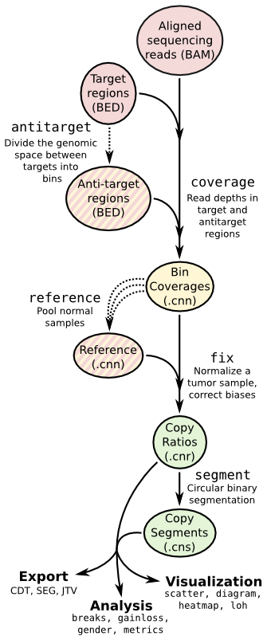

Copy number calling pipeline
============================

Each operation is invoked as a sub-command of the main script, ``cnvkit.py``.
A listing of all sub-commands can be obtained with ``cnvkit --help`` or ``-h``,
and the usage information for each sub-command can be shown with the ``--help``
or ``-h`` option after each sub-command name::

    cnvkit.py -h
    cnvkit.py antitarget -h

A sensible output file name is normally chosen if it isn't specified, except in
the case of the text reporting commands, which print to standard output by
default, and the matplotlib-based plotting commands (not ``diagram``), which
will display the plots interactively on the screen by default.

.. _batch:

batch
-----

Run the CNVkit pipeline on one or more BAM files::

    cnvkit.py batch Sample.bam -t Tiled.bed -a Background.bed -r Reference.cnn
    cnvkit.py batch *.bam --output-dir CNVs/ -t Tiled.bed -a Background.bed -r Reference.cnn

With the ``-p`` option, process each of the BAM files in parallel, as separate
subprocesses. The status messages logged to the console will be somewhat
disorderly, but the pipeline will take advantage of multiple CPU cores to
complete sooner.

::

    cnvkit.py batch *.bam -d CNVs/ -t Tiled.bed -a Background.bed -r Reference.cnn -p 8

The pipeline executed by the ``batch`` command is equivalent to::

    cnvkit.py coverage Sample.bam Tiled.bed -o Sample.targetcoverage.cnn
    cnvkit.py coverage Sample.bam Background.bed -o Sample.antitargetcoverage.cnn
    cnvkit.py fix Sample.targetcoverage.cnn Sample.antitargetcoverage.cnn Reference_cnn -o Sample.cnr
    cnvkit.py segment Sample.cnr -o Sample.cns

See the rest of the commands below to learn about each of these steps and other
functionality in CNVkit.

.. _target:

target
------

Prepare a BED file of baited regions for use with CNVkit.

::

    cnvkit.py target Tiled.bed --annotate refFlat.txt --split -o Targets.bed

The BED file should be the baited genomic regions for your target capture kit,
as provided by your vendor. Since these regions (usually exons) may be of
unequal size, the ``--split`` option divides the larger regions so that the
average bin size after dividing is close to the size specified by
``--average-size``.

In case the vendor BED file does not label each region with a corresponding gene
name, the ``--annotate`` option can add or replace these labels.
Gene annotation databases, e.g. RefSeq or Ensembl, are available in "flat"
format from UCSC (e.g. `refFlat.txt for hg19
<http://hgdownload.soe.ucsc.edu/goldenPath/hg19/database/refFlat.txt.gz>`_).

In other cases the region labels are a combination of human-readable gene names
and database accession codes, separated by commas (e.g.
"ref|BRAF,mRNA|AB529216,ens|ENST00000496384"). The ``--short-names`` option
splits these accessions on commas, then chooses the single accession that covers
in the maximum number of consecutive regions that share that accession, and
applies it as the new label for those regions. (You may find it simpler to just
apply the refFlat annotations.)

If you need higher resolution, you can select a smaller average size for your
:ref:`target` and :ref:`antitarget` bins.

Exons in the human genome have an average size of about 200bp. The target bin
size default of 267 is chosen so that splitting larger exons will produce bins
with a minimum size of 200. Since bins that contain fewer reads result in a
noisier copy number signal, this approach ensures the "noisiness" of the bins
produced by splitting larger exons will be no worse than average.

Setting the average size of target bins to 100bp, for example, will yield about
twice as many target bins, which can result in more precise and perhaps more
accurate segmentation. However, the number of reads counted in each bin will be
reduced by about half, increasing the variance or "noise" in bin-level
coverages. An excess of noisy bins can make visualization difficult, and since
the noise may not be Gaussian, especially in the presence of many bins with zero
reads, the CBS algorithm could produce less accurate segmentation results on
low-coverage samples.
In practice we see good results with an average of 200-300 reads per bin; we
therefore recommend an overall on-target sequencing coverage depth of at least
200x to 300x with a read length of 100 to justify reducing the average target
bin size to 100bp.

.. _antitarget:

antitarget
----------

Given a "target" BED file that lists the chromosomal coordinates of the tiled
regions used for targeted resequencing, derive a BED file
off-target/"antitarget"/"background" regions.

::

    cnvkit.py antitarget Tiled.bed -g data/access-5kb-mappable.hg19.bed -o Background.bed

Many fully sequenced genomes, including the human genome, contain large regions
of DNA that are inaccessable to sequencing. (These are mainly the centromeres,
telomeres, and highly repetitive regions.) In the FASTA genome sequence these
regions are filled in with large stretches of "N" characters. These regions
cannot be mapped by resequencing, so we can avoid them when calculating the
antitarget locations by passing the locations of the accessible sequence regions
with the ``-g`` or ``--access`` option. These regions are precomputed for the
UCSC reference human genome hg19 (data/access-5kb-mappable.hg19.bed), and can be
computed for other genomes with the included script ``genome2access.py``.

CNVkit uses a cautious default off-target bin size that, in our experience, will
typically include more reads than the average on-target bin.  However, we
encourage the user to examine the coverage statistics reported by CNVkit and
specify a properly calculated off-target bin size for their samples in order to
maximize copy number information.

.. _coverage:

coverage
--------

Calculate coverage in the given regions from BAM read depths.

With the -p option, calculates mean read depth from a pileup; otherwise, counts
the number of read start positions in the interval and normalizes to the
interval size.

::

    cnvkit.py coverage Sample.bam Tiled.bed -o Sample.targetcoverage.cnn
    cnvkit.py coverage Sample.bam Background.bed -o Sample.antitargetcoverage.cnn

Summary statistics of read counts and their binning are printed to standard
error when CNVkit finishes calculating the coverage of each sample (through
either the :ref:`batch` or :ref:`coverage` commands).

.. note::
    **The BAM file must be sorted.** CNVkit will check that the first few reads
    are sorted in positional order, and raise an error if they are not. However,
    CNVkit might not notice if reads later in the file are unsorted; it will
    just silently ignore the out-of-order reads and the coverages will be zero
    after that point. So be safe, and sort your BAM file properly.

.. note::
    **If you've prebuilt the BAM index file (.bai), make sure its timestamp is
    later than the BAM file's.** CNVkit will automatically index the BAM file
    if needed -- that is, if the .bai file is missing, *or* if the timestamp
    of the .bai file is older than that of the corresponding .bam file. This
    is done in case the BAM file has changed after the index was initially
    created. (If the index is wrong, CNVkit will not catch this, and coverages
    will be mysteriously truncated to zero after a certain point.) *However,*
    if you copy a set of BAM files and their index files (.bai) together over
    a network, the smaller .bai files will typically finish downloading first,
    and so their timestamp will be earlier than the corresponding BAM or FASTA
    file. CNVkit will then consider the index files to be out of date and will
    attempt to rebuild them. To prevent this, use the Unix command ``touch``
    to update the timestamp on the index files after all files have been
    downloaded.

.. _reference:

reference
---------

Compile a copy-number reference from the given files or directory (containing
normal samples). If given a reference genome (-f option), also calculate the GC
content of each region.

::

    cnvkit.py reference -o Reference.cnn -f ucsc.hg19.fa *targetcoverage.cnn

If normal samples are not available, it will sometimes work OK to build the
reference from a collection of tumor samples. You can use the ``scatter`` command
on the raw ``.cnn`` coverage files to help choose samples with relatively
minimal CNVs for use in the reference.

Notes on sample selection:

* You can use ``cnvkit.py metrics *.cnr -s *.cns`` to see if any samples are
  especially noisy. See the :ref:`metrics` command.

* CNVkit will usually call larger CNAs reliably down to about 10x on-target
  coverage, but there will tend to be more spurious segments, and smaller-scale
  or subclonal CNAs can be hard to infer below that point.
  This is well below the minimum coverage thresholds typically used for SNV
  calling, especially for targeted sequencing of tumor samples that may have
  significant normal-cell contamination and subclonal tumor-cell populations.
  So, a normal sample that passes your other QC checks will probably be OK to
  use in building a CNVkit reference -- assuming it was sequenced on the same
  platform as the other samples you're calling.

Alternatively, you can create a "flat" reference of neutral copy number (i.e.
log2 0.0) for each probe from the target and antitarget interval files. This
still computes the GC content of each region if the reference genome is given.

::

    cnvkit.py reference -o FlatReference.cnn -f ucsc.hg19.fa -t Tiled.bed -a Background.bed

Two possible uses for a flat reference:

1. Extract copy number information from one or a small number of tumor samples
   when no suitable reference or set of normal samples is available. The copy
   number calls will not be as accurate, but large-scale CNVs may still be
   visible.
2. Create a "dummy" reference to use as input to the ``batch`` command to
   process a set of normal samples. Then, create a "real" reference from the
   resulting ``*.targetcoverage.cnn`` and ``*.antitargetcoverage.cnn`` files,
   and re-run ``batch`` on a set of tumor samples using this updated reference.

.. note::
    As with BAM files, CNVkit will automatically index the FASTA file if the
    corresponding .fai file is missing or out of date. If you have copied the
    FASTA file and its index together over a network, you may need to use the
    ``touch`` command to update the .fai file's timestamp so that CNVkit will
    recognize it as up-to-date.

.. _fix:

fix
---

Combine the uncorrected target and antitarget coverage tables (.cnn) and
correct for biases in regional coverage and GC content, according to the given
reference. Output a table of copy number ratios (.cnr).

::

    cnvkit.py fix Sample.targetcoverage.cnn Sample.antitargetcoverage.cnn Reference.cnn -o Sample.cnr

.. _segment:

segment
-------

Infer discrete copy number segments from the given coverage table::

    cnvkit.py segment Sample.cnr -o Sample.cns

By default this uses the circular binary segmentation algorithm (CBS), but with
the ``-m`` option, the faster `Fused Lasso
<http://statweb.stanford.edu/~tibs/cghFLasso.html>`_ algorithm (``flasso``) or
even faster but less accurate `HaarSeg
<http://webee.technion.ac.il/people/YoninaEldar/Info/software/HaarSeg.htm>`_
algorithm (``haar``) can be used instead.

Fused Lasso additionally performs significance testing to distinguish CNAs from
regions of neutral copy number, whereas CBS and HaarSeg by themselves only
identify the supported segmentation breakpoints.

.. _call:

call
----

Given segmented log2 ratio estimates (.cns), round the copy ratio estimates to
integer values using either:

- A list of threshold log2 values for each copy number state, or
- Some algebra, given known tumor cell fraction and normal ploidy.

::

    cnvkit.py call Sample.cns -o Sample.call.cns
    cnvkit.py call Sample.cns -y -m clonal --purity 0.65 -o Sample.call-clonal.cns
    cnvkit.py call Sample.cns -y -m threshold -t=-1.1,-0.4,0.3,0.7 -o Sample.call-threshold.cns

The output is another .cns file, where the values in the log2 column are still
log2-transformed, but represent integers in log2 scale -- e.g. a neutral
diploid state is represented as 0.0, not the integer 2. These output files are
still compatible with the other CNVkit commands that accept .cns files, and can
be plotted the same way.

The "clonal" method considers the observed log2 ratios in the input .cns file
as a mix of some fraction of tumor cells (specified by ``--purity``), possibly
with altered copy number, and a remainder of normal cells with neutral copy
number (specified by ``--ploidy`` for autosomes). This equation is rearranged
to find the absolute copy number of the tumor cells alone, rounded to the
nearest integer. The expected and observed ploidy of the sex chromosomes (X and
Y) is different, so it's important to specify ``-y``/``--male-reference`` if a
male reference was used; the sample gender can be specified if known, otherwise
it will be guessed from the log2 ratio of chromosome X.

The "threshold" method simply applies fixed log2 ratio cutoff values for each
integer copy number state. This method therefore does not require the tumor
cell fraction or purity to be known. The default cutoffs are reasonable for a
tumor sample with purity of at least 40% or so; for germline samples, the
``-t`` values shown above may yield more accurate calls.
