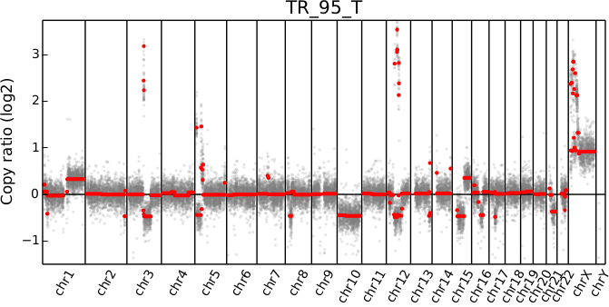
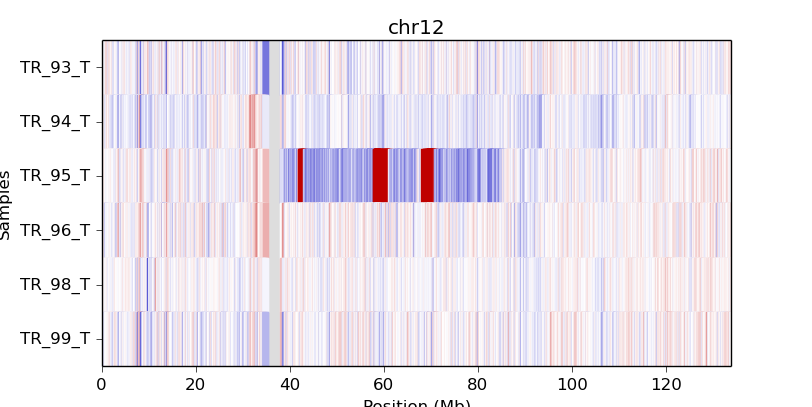

Plots and graphics
==================

.. _scatter:

scatter
-------

Plot bin-level log2 coverages and segmentation calls together.  Without any
further arguments, this plots the genome-wide copy number in a form familiar to
those who have used array CGH.

::

    cnvkit.py scatter Sample.cnr -s Sample.cns
    # Shell shorthand
    cnvkit.py scatter -s TR_95_T.cn{s,r}

The options ``--chromosome`` and ``--gene`` (or their single-letter equivalents)
focus the plot on the specified region::

    cnvkit.py scatter -s Sample.cn{s,r} -c chr7
    cnvkit.py scatter -s Sample.cn{s,r} -c chr7:140434347-140624540
    cnvkit.py scatter -s Sample.cn{s,r} -g BRAF

In the latter two cases, the genes in the specified region or with the specified
names will be highlighted and labeled in the plot. The ``--width`` (``-w``)
argument determines the size of the chromosomal regions to show flanking the
selected region. Note that only targeted genes can be highlighted and labeled;
genes that are not included in the list of targets are not labeled in the .cnn
or .cnr files and are therefore invisible to CNVkit.

The arguments ``-c`` and ``-g`` can be combined to e.g. highlight
specific genes in a larger context::

    # Show a chromosome arm, highlight one gene
    cnvkit.py scatter -s Sample.cn{s,r} -c chr5:100-50000000 -g TERT
    # Show the whole chromosome, highlight two genes
    cnvkit.py scatter -s Sample.cn{s,r} -c chr7 -g BRAF,MET
    # Highlight two genes in a specified range
    cnvkit.py scatter -s TR_95_T.cn{s,r} -c chr12:50000000-80000000 -g CDK4,MDM2

.. image:: TR_95_T-CDK4-MDM2-scatter.png

When a chromosomal region is plotted with CNVkit's "scatter" command , the size
of the plotted datapoints is proportional to the weight of each point used in
segmentation -- a relatively small point indicates a less reliable bin.
Therefore, if you see a cluster of smaller points in a short segment (or where
you think there ought to be a segment, but there isn't one), then you can cast
some doubt on the copy number call in that region. The dispersion of points
around the segmentation line also visually indicates the level of noise or
uncertainty.

To create multiple region-specific plots at once, the regions of interest can be
listed in a separate file and passed to the ``scattter`` command with the
``-l``/``--range-list`` option. This is equivalent to creating the plots
separately with the ``-c`` option and then combining the plots into a single
multi-page PDF.

Loss of heterozygosity (LOH) can be viewed alongside copy number by passing
variants as a VCF file with the ``-v`` option. Heterozygous SNP allelic
frequencies are shown in a subplot below the CNV scatter plot. (Also see the
:ref:`loh` command.)

::

    cnvkit.py scatter Sample.cnr -s Sample.cns -v Sample.vcf

The bin-level log2 ratios or coverages can also be plotted without segmentation
calls::

    cnvkit.py scatter Sample.cnr

This can be useful for viewing the raw, un-corrected coverage depths when
deciding which samples to use to build a profile, or simply to see the coverages
without being helped/biased by the called segments.

The ``--trend`` option (``-t``) adds a smoothed trendline to the plot. This is
fairly superfluous if a valid segment file is given, but could be helpful if the
CBS dependency is not available, or if you're skeptical of the segmentation in a
region.

.. _loh:

loh
---

Plot allelic frequencies at each variant position in a VCF file. Divergence from
0.5 indicates loss of heterozygosity (LOH) in a tumor sample.

::

    cnvkit.py loh Sample.vcf
    cnvkit.py loh Sample.vcf -s Sample.cns

.. _diagram:

diagram
-------

Draw copy number (either individual bins (.cnn, .cnr) or segments (.cns)) on
chromosomes as an ideogram. If both the bin-level log2 ratios and segmentation
calls are given, show them side-by-side on each chromosome (segments on the left
side, bins on the right side).

::

    cnvkit.py diagram Sample.cnr
    cnvkit.py diagram -s Sample.cns
    cnvkit.py diagram -s Sample.cns Sample.cnr

If bin-level log2 ratios are provided (.cnr), genes with log2 ratio values
beyond a fixed threshold will be labeled on the plot.
This plot style works best with target panels of a few hundred genes at most;
with whole-exome sequencing there are often so many genes affected by CNAs that
the individual gene labels become difficult to read.

If only segments are provided (``-s``), gene labels are not shown.  This plot is
then equivalent to the ``heatmap`` command, which effectively summarizes the
segmented values from many samples.

.. _heatmap:

heatmap
-------

Draw copy number (either bins (.cnn, .cnr) or segments (.cns)) for multiple
samples as a heatmap.

To get an overview of the larger-scale CNVs in a cohort, use the
"heatmap" command on all .cns files::

    cnvkit.py heatmap *.cns

.. image:: heatmap-tr-nod.png

The color range can be subtly rescaled with the ``-d`` option to de-emphasize
low-amplitude segments, which are likely spurious CNAs::

    cnvkit.py heatmap *.cns -d

.. image:: heatmap-tr.png

A heatmap can also be drawn from bin-level log2 coverages or copy ratios (.cnn,
.cnr), but this will be extremely slow at the genome-wide level.
Consider doing this with a smaller number of samples and only for one chromosome
at a time, using the ``-c`` option::

    cnvkit.py heatmap TR_9*T.cnr -c chr12  # Slow!

If an output file name is not specified with the ``-o`` option, an interactive
matplotlib window will open, allowing you to select smaller regions, zoom in,
and save the image as a PDF or PNG file.
